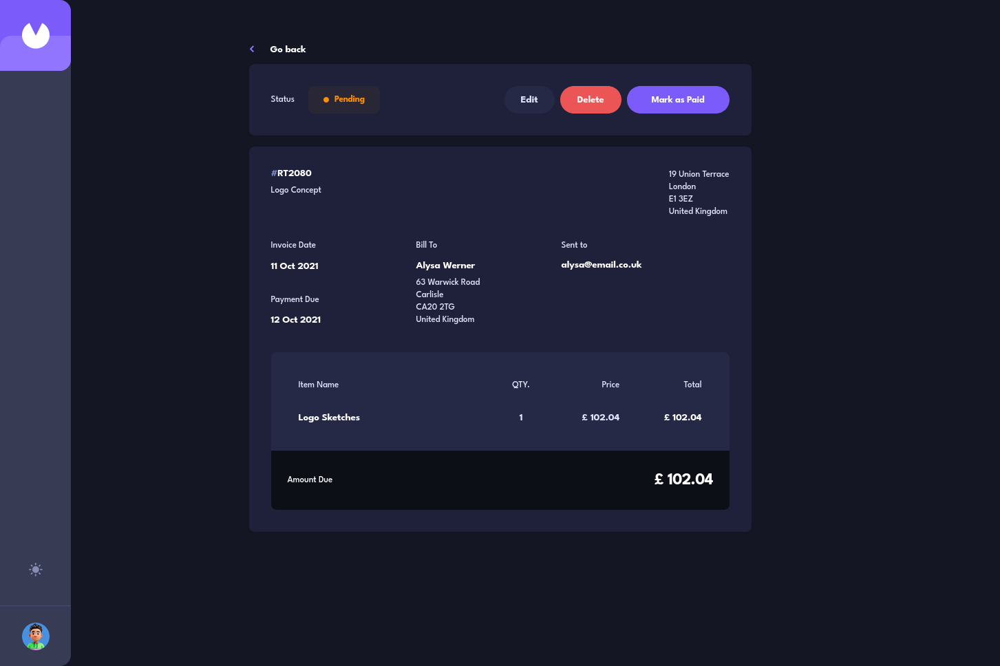

# Frontend Mentor - Invoice app solution

This is a solution to the [Invoice app challenge on Frontend Mentor](https://www.frontendmentor.io/challenges/invoice-app-i7KaLTQjl). Frontend Mentor challenges help you improve your coding skills by building realistic projects.

## Table of contents

- [Frontend Mentor - Invoice app solution](#frontend-mentor---invoice-app-solution)
  - [Table of contents](#table-of-contents)
  - [Overview](#overview)
    - [The challenge](#the-challenge)
    - [Screenshot](#screenshot)
    - [Links](#links)
  - [My process](#my-process)
    - [Built with](#built-with)
  - [Author](#author)

## Overview

### The challenge

Users should be able to:

- View the optimal layout for the app depending on their device's screen size
- See hover states for all interactive elements on the page
- Create, read, update, and delete invoices
- Receive form validations when trying to create/edit an invoice
- Save draft invoices, and mark pending invoices as paid
- Filter invoices by status (draft/pending/paid)
- Toggle light and dark mode
- **Bonus**: Keep track of any changes, even after refreshing the browser (`localStorage` could be used for this if you're not building out a full-stack app)

### Screenshot

### Links

- Live Site URL: [https://nextjs-invoice-app-pearl.vercel.app/](https://nextjs-invoice-app-pearl.vercel.app/)

## My process

### Built with

- Semantic HTML5 markup
- CSS custom properties
- Flexbox
- CSS Grid
- Mobile-first workflow
- [React](https://reactjs.org/) - JS library
- [Next.js](https://nextjs.org/) - React framework
- [Shadcn/ui](https://ui.shadcn.com/) - For styles
- [PostgreSQL](https://www.postgresql.org/) - For database
- [Auth.js](https://authjs.dev/) - For authentication

## Author

- Website - [Denis Pianelli](https://www.denispianelli.dev/en)
- LinkedIn - [@denispianelli](https://www.linkedin.com/in/denis-pianelli/)
